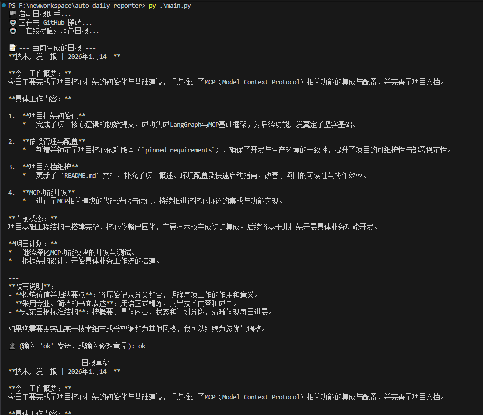
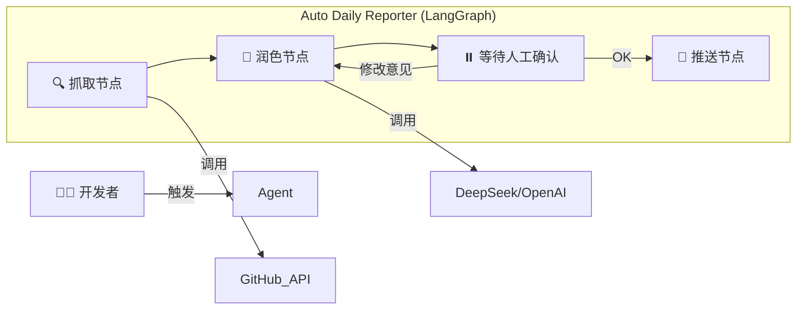

# 🚀 Auto Daily Reporter | 懒人日报神器

<div align="center">


**拒绝流水账，让 AI 帮你体面地“吹牛”。**

[快速开始](#-快速开始) • [核心特性](#-核心特性) • [技术原理](#-技术原理) • [心路历程](#-心路历程)

</div>

---

## 📖 简介

**Auto Daily Reporter** 是一个专为程序员设计的自动化日报生成工具。

你是否每天下班前都要抓耳挠腮：*“我今天到底干了啥？”*
你是否厌倦了把 `git commit` 里的 "fix bug", "update" 这种琐碎的日志复制粘贴进日报里？

这个工具能自动拉取你今天的 GitHub 提交记录，通过 AI (LLM) 进行润色和总结，生成一份**专业、高大上、且条理清晰**的工作日报。

## 💡 心路历程 (Why I built this)

说实话，做这个项目的初衷有两个：

1.  **我真的很讨厌写日报。** 作为开发者，我认为代码提交记录就是最好的证明，为什么还要花时间去“美化”它？我想把这个过程自动化。
2.  **我想实战验证 LangGraph + MCP + Agent Skills。**
    最近 **LangGraph** (图编排) 和 **MCP** (Model Context Protocol) 的概念很火，我在油管上看了很多视频，听起来很厉害，但如果不自己动手写一行代码，永远只是“听过”。
    
    于是我决定：**与其空谈概念，不如做一个能跑的小工具。**
    
    我尝试用 **LangGraph** 来控制“抓取 -> 思考 -> 润色 -> 确认”的思考链路，用 **Skills** 的思维去封装 GitHub 和消息推送工具。虽然目前它还是一个 MVP (最小可行性产品)，但它是一个真正的 Agent 实践。

---

## ✨ 核心特性

* **🤖 智能润色**：告别 `fix bug`，AI 会自动将其转化为“优化核心模块稳定性，解决了潜在的竞态条件问题”。
* **🔗 自动抓取**：基于 GitHub API，自动拉取指定分支（如 `dev`）的当日提交记录。
* **🧠 Human-in-the-Loop**：**拒绝 AI 瞎编**。LangGraph 引入了“人机回环”机制，生成的日报草稿会先发给你确认，你可以输入 `ok` 发送，也可以直接用自然语言告诉它“把第一条删掉”，AI 会重新修改。
* **🔌 易于扩展**：基于 `.env` 配置，支持 DeepSeek、OpenAI 等多种 LLM 模型。

## 🖼️ 效果演示

### 1. 终端交互 (CLI)
AI 自动分析了我的提交记录，并生成了结构化的日报。注意，它停下来等待我的确认：

### 2. 润色对比
| 原始 Commit | Auto Daily Reporter 生成 |
| :--- | :--- |
| `fix login bug` | **用户认证模块优化**：修复了登录页面的异常边界情况，提升了用户登录成功率。 |
| `update readme` | **文档建设**：完善了项目部署文档，降低了新成员的上手门槛。 |

---

## 🛠️ 技术原理

本项目采用了最新的 **AI Agent 架构**：



---

## 🚀 快速开始

### 1. 克隆项目

```bash
git clone https://github.com/papacs/auto-daily-reporter.git
cd auto-daily-reporter

```

### 2. 安装依赖

> 推荐使用 python 3.10+

```bash
pip install -r requirements.txt

```

### 3. 配置环境变量

复制 `.env.example` 为 `.env`，并填入你的配置：

```ini
# GitHub 配置
GITHUB_TOKEN=你的ghp_token
GITHUB_USER=你的用户名 (例如 papacs)
GITHUB_REPO=你的仓库名，支持多个仓库用逗号分隔 (例如 conClean,another-repo)
GITHUB_BRANCH_FILTER=可选，分支模糊过滤关键词，逗号分隔 (例如 dev,release,hotfix)
GITHUB_DATE=可选，指定日期 (yyyy-mm-dd)，为空默认当天

# AI 模型配置 (支持 DeepSeek/OpenAI)
OPENAI_API_KEY=sk-xxxxxx
OPENAI_API_BASE=https://api.deepseek.com/v1

```

### 4. 运行

```bash
python main.py

```

> 说明：不设置 `GITHUB_SHA` 时会自动扫描每个仓库的全部分支来抓取提交记录；如需缩小范围，可使用 `GITHUB_BRANCH_FILTER` 进行模糊过滤（大小写不敏感）。`GITHUB_DATE` 可指定要拉取的日期，未设置时默认当天。

---

## 🗓️ Roadmap

* [x] 本地 CLI 版本 (已完成)
* [x] GitHub 提交记录自动抓取
* [x] LangGraph 人机交互流程
* [ ] **v1.5**: 集成 PushPlus/Server酱，推送到微信
* [ ] **v2.0**: 部署至 GitHub Actions，实现全自动定时触发

## 🤝 贡献

如果你也对 LangGraph 感兴趣，或者有更好的 Prompt 技巧，欢迎提交 Issue 或 PR！让我们一起把“懒”发挥到极致。

---

<div align="center">
Made with ❤️ by a lazy programmer
</div>
